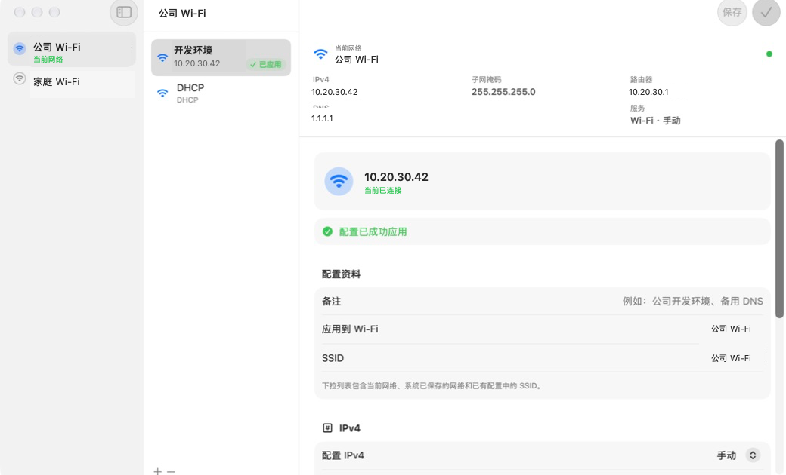
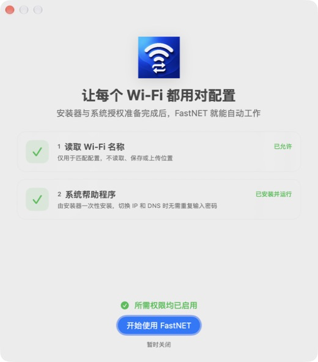

<div align="center">
  

  # FastNET

  **让每个 Wi‑Fi，都自动使用正确的网络配置。**

  一款为 macOS 打造的轻量网络配置切换工具。告别在家庭、公司和实验室之间反复修改 IP 与 DNS。

  [](https://github.com/yc004/FastNET/releases/latest)
  [](Package.swift)
  [](https://github.com/yc004/FastNET/releases/latest)

  [访问产品官网](https://yc004.github.io/FastNET/) · [下载最新版](https://github.com/yc004/FastNET/releases/latest) · [查看功能](#核心体验) · [开发与构建](#开发与构建)
</div>

---

## 为什么需要 FastNET？

macOS 的静态 IPv4 和 DNS 设置绑定在网络服务上，而不是每一个 Wi‑Fi。你在公司设置的固定 IP，连接家庭 Wi‑Fi 后仍可能继续生效；下一次换网络，又要重新打开系统设置逐项修改。

FastNET 根据当前 Wi‑Fi 名称匹配配置文件，在网络变化时自动应用正确的 DHCP、静态 IPv4 和 DNS 设置。配置一次，之后安静地工作。

## 界面预览

<div align="center">
  
  <p><sub>原生三栏布局：网络、配置文件与配置详情一目了然</sub></p>
</div>

主窗口采用类似 macOS“备忘录”的原生三栏布局：左侧选择网络，中间选择配置文件，右侧查看和编辑详细参数。菜单栏则提供当前网络状态与常用操作，无需一直打开主窗口。

<table>
  <tr>
    <td align="center" width="58%">
      <br>
      <sub>首次启动时集中完成必要授权</sub>
    </td>
    <td align="center" width="42%">
      <br>
      <sub>自动切换时，从菜单栏图标弹出轻量提示</sub>
    </td>
  </tr>
</table>

## 核心体验

| | 功能 | 体验 |
|---|---|---|
| 📡 | **按 Wi‑Fi 自动切换** | 连接到指定 SSID 后，自动应用对应配置 |
| 🌐 | **DHCP 与静态 IPv4** | 保存 IP 地址、子网掩码和路由器设置 |
| 🧭 | **独立 DNS** | 为不同网络设置不同 DNS，并可在手动 DNS 后附加默认 DNS |
| 🗂️ | **一个 SSID，多套配置** | 同一网络可保存开发、测试、备用 DNS 等多个带备注配置 |
| ⚡ | **菜单栏快速操作** | 查看当前 IP、手动应用配置、控制自动切换和 Dock 图标 |
| ✅ | **清晰的应用状态** | 实时展示正在应用、当前应用、应用成功或失败 |
| 🔄 | **内置软件更新** | 自动检查 GitHub Release，可选择后台下载新版安装镜像 |
| ✨ | **原生 macOS 设计** | SwiftUI 三栏布局、SF Symbols、Liquid Glass 气泡与系统动效 |
| 🔐 | **一次安装，免重复密码** | 安装时完成一次管理员授权，之后切换 IP 与 DNS 无需重复输入 |

### 为同一个 Wi‑Fi 保存多种方案

每个 SSID 可以拥有多个配置文件，但只有一个配置会在连接后自动应用。其他配置保留在中栏和菜单栏中，随时手动切换。例如：

- `公司 Wi‑Fi · 开发环境`
- `公司 Wi‑Fi · 测试网段`
- `公司 Wi‑Fi · DHCP`
- `家庭 Wi‑Fi · 公共 DNS`

## 安装

### 系统要求

- macOS 26 或更高版本
- Apple Silicon Mac
- 管理员账户或可用的管理员凭据

### 安装步骤

1. 从 [Releases](https://github.com/yc004/FastNET/releases/latest) 下载 `FastNET-<版本>-macOS.dmg`。
2. 打开 DMG，双击 **安装 FastNET.pkg**。
3. 按照 macOS 原生安装器提示，完成一次管理员授权。
4. 从“应用程序”文件夹打开 FastNET，并允许读取 Wi‑Fi 名称。
5. 新建配置并选择目标 SSID；需要自动切换时，打开“连接此 Wi‑Fi 时自动应用”。

## 它如何工作


FastNET 的 PKG 安装器会把一个最小化的帮助程序安装到 `/Library/PrivilegedHelperTools`，并由 `launchd` 按需启动。主应用退出时帮助程序随之停止；下次启动 FastNET 时会自动重新唤醒。

帮助程序只接受预定义的网络配置请求，并执行以下操作：

- 切换 DHCP 或静态 IPv4
- 设置子网掩码和路由器
- 设置或清空 DNS 服务器
- 读取 DHCP 提供的默认 DNS

## 隐私与安全

- 所有网络配置仅保存在本机 `UserDefaults` 中。
- FastNET 不创建账户、不上传配置，也不包含遥测服务。
- 软件更新检查只访问 GitHub Releases API，不会随请求发送网络配置。
- 位置权限只用于通过 CoreWLAN 读取当前 SSID，不读取定位坐标。
- 网络修改由独立的最小权限帮助程序执行，主界面不会以 root 身份运行。
- 安装脚本会设置明确的 `root:wheel` 属主和文件权限。
- 旧版帮助程序会在升级安装时停止，避免多个服务同时修改网络。

## 常见问题

<details>
<summary><strong>为什么读取 Wi‑Fi 名称需要位置权限？</strong></summary>

macOS 要求应用获得位置服务授权后，CoreWLAN 才会返回当前 Wi‑Fi 名称。FastNET 只读取 SSID，用于查找对应配置，不读取或保存位置坐标。
</details>

<details>
<summary><strong>为什么安装时需要管理员授权？</strong></summary>

修改系统网络设置需要增强权限。安装器会一次性部署一个功能受限的系统帮助程序，因此日常自动切换不需要反复输入密码。
</details>

<details>
<summary><strong>为什么“允许在后台”里没有 FastNET？</strong></summary>

1.7.0 起采用一次性 PKG 安装模式，不再通过 `SMAppService` 注册后台项目。帮助程序由安装器部署，并由 `launchd` 按需运行，因此不依赖该设置页面的开关。
</details>

<details>
<summary><strong>退出 FastNET 后帮助程序还会运行吗？</strong></summary>

不会。正常退出 FastNET 时会通知帮助程序结束进程；LaunchDaemon 注册会保留，以便下次启动应用时按需恢复。
</details>

## 开发与构建

项目使用 Swift 6、SwiftUI 和 Swift Package Manager。

```bash
git clone https://github.com/yc004/FastNET.git
cd FastNET
swift test
```

开发时可以使用 Xcode 打开 `Package.swift`。生成本地测试安装包：

```bash
./Scripts/package-app.sh
./Scripts/package-installer.sh
./Scripts/package-dmg.sh
```

构建产物位于 `dist/`：

| 文件 | 用途 |
|---|---|
| `FastNET.app` | 主应用开发构建 |
| `Install-FastNET-<版本>.pkg` | 一次性管理员安装器 |
| `FastNET-<版本>-macOS.dmg` | 面向用户的磁盘映像 |

## 项目结构

```text
FastNET
├── Sources/FastNET          # SwiftUI 主应用、菜单栏与网络状态
├── Sources/FastNETHelper    # 最小化特权 XPC 帮助程序
├── Sources/FastNETShared    # 主应用与帮助程序共享协议
├── Packaging                # Info.plist、LaunchDaemon 与安装脚本
├── Scripts                  # App、PKG、DMG 构建工具
└── Tests                    # 配置、解析、迁移与界面策略测试
```

---

<div align="center">
  <strong>FastNET</strong><br>
  <sub>更少的网络设置，更多的顺畅连接。</sub>
</div>
